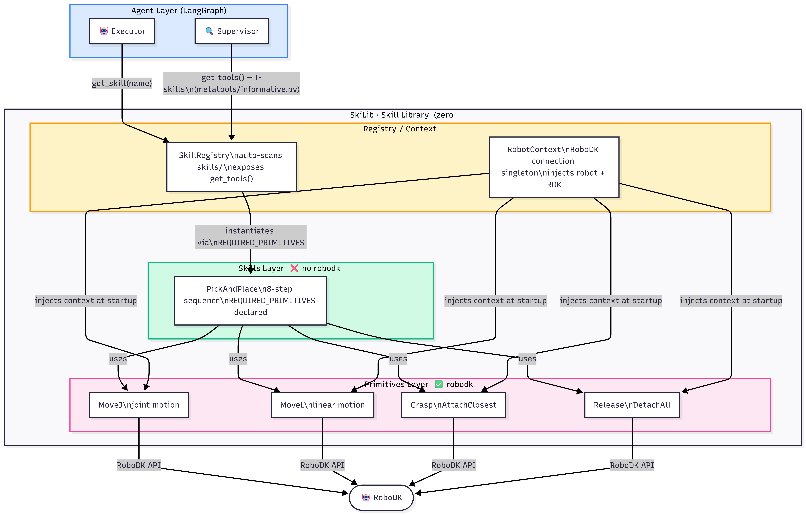
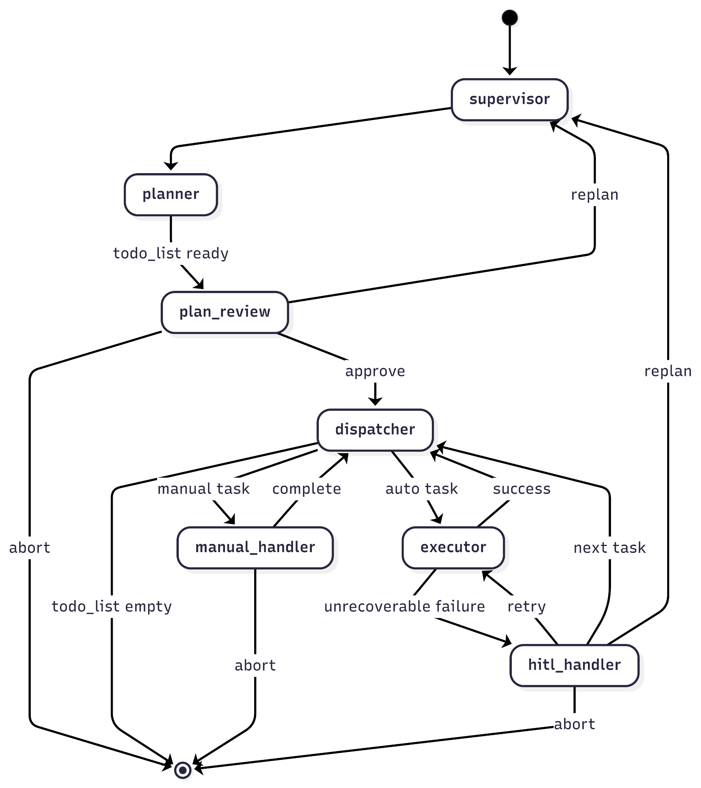

这一个月来做的大部分工作零零散散有笔记但是是以英文存在的，加之大部分是在框架探索阶段的思考决策，感觉缺乏工程上的技术总结，于是便有想法先总结过去的经验catchup，不过量实在太大，先请Claude代劳。后面进入SFT阶段后还是改用手写。

## 背景

故事从一段实习开始。我加入时，项目已经到了末期——一条智能供应链的末端：自动导引车把零件从零件台送到装配台，UR10 机械臂完成最后的组装。CNC 加工、零件运输、机器人装配，三个子系统拼在一起。我的工作是负责机器人装配这一段。

不过早先的 supervisor 也已离任，换来的是更加熟悉 AI 方向的新老板。此时项目基本要结题，但新老板提出可以以项目为背景继续探索：在这套系统上，LLM 能做什么？能做到什么程度？能不能实现真正的 Low-Code 机器人控制——操作员用自然语言描述任务，系统自动规划并执行？更进一步，有没有可能用这个场景生成训练数据，探索机器人专用 LLM 的 Fine-Tuning 路径，应用到未来的本地小模型上？

RoboSkiAgent 就是在这个背景下开始的。

---

## 一个约束驱动了整个架构

在动手之前，先确定了一条设计约束：**LLM 层永远不能出现坐标数值**。

LLM是概率模型，无法从文字上做数学推理。让 LLM 说"把 `Part_A` 放到 `Station_2`"是合理的，让它说"在 x=312.5, y=-88.3 的位置上空100mm就位并放置"是强迫它做不擅长的事。坐标计算应该在底层完成，LLM 处理符号和意图。

这条约束直接产生了一个分层问题：谁来算坐标？谁来理解意图？由此决定了 SkiLib 和 Agent 层的分离。



---

## SkiLib：先把手脚造好

在接入任何 LLM 框架之前，先把机器人的"手脚"封装成一个纯 Python 库，**完全没有 LangGraph 依赖**。

这个选择不是偶然的，有两个具体动机：

**可独立测试**：技能库可以单独 debug，Agent 框架只是调用它的客户，不会把测试环境和编排环境混在一起。

**底层平台可迁移**：项目使用的是 RoboDK 仿真 + UR10，但后续有计划迁移到 Genesis——主要原因是 Genesis 更适合大规模并行仿真，可以用来生成 SFT 所需的大量 trajectory 数据。如果技能库和编排框架耦合在一起，换仿真平台就要同时改 Agent 逻辑；现在两者分离，换平台只需要重新实现 Primitive 层，Skill 逻辑和 Agent 编排完全不动。

### 两层抽象：Primitive vs Skill

技能库分成两层：

**Primitive（原语）** 是最小的、平台相关的动作单元：`MoveJ`（关节插值运动）、`MoveL`（直线运动）、`Grasp`、`Release`。这一层可以 `import robodk`，知道所有硬件细节，负责跟机器人打交道。

**Skill（技能）** 是平台无关的业务逻辑，**禁止 `import robodk`**，只依赖 `BasePrimitive` 接口。`PickAndPlace` 把 8 个步骤组合在一起：接近点 → 下降 → 抓取 → 提升 → 运输 → 下降 → 释放 → 撤离。

```python
class PickAndPlace(BaseSkill):
    REQUIRED_PRIMITIVES = ['MoveJ', 'MoveL', 'Grasp', 'Release']

    def execute(self, pick_target: str, place_target: str, ...) -> SkillResult:
        # pick_target 是符号名，方法内部解析为 RoboDK Item
        ctx = RobotContext.instance()
        pick_item = ctx.RDK.Item(pick_target)
        ...
```


这个分法在写测试时价值立刻体现出来：Skill 层的逻辑可以用 mock primitives 做单元测试，完全不需要启动仿真软件。

### SkillResult：一道防火墙

`SkillResult` 是所有公开方法的统一返回类型，**目的只有一个：LLM 永远看不到 Python traceback**。

所有底层异常必须在 Primitive 层内部被捕获，翻译成结构化描述，才能往上传：

```python
# LLM 看到的
{
    "success": False,
    "phase": "PLANNING",
    "error_type": "IK_FAILURE",
    "message": "No IK solution for Station_3 in current configuration.",
    "suggestion": "Try approaching from above."
}
```

`error_type` 用的是字符串常量而不是枚举，原因很实际：不同 Primitive 有各自领域特有的错误类型，用枚举意味着每次加新 Primitive 都要改核心 `base.py`。字符串常量在各自模块里定义，不侵入核心文件。

`ExecutionPhase` 则用了枚举（VALIDATION / PLANNING / EXECUTION），因为这三个阶段对应 LLM 恢复时的三种决策分支，不会随 Primitive 扩展而变化——这两个选择背后的逻辑是一致的：**稳定的抽象用枚举，容易变化的用字符串**。

### `@require_robot_active`：硬件锁

```python
@require_robot_active
def execute(self, target: str) -> SkillResult: ...
```

系统挂起时（`halt_flag=True`），任何带这个装饰器的调用都直接返回 `ERROR_ROBOT_INACTIVE`，不触碰硬件。但这里有一个死锁风险：如果 `resume()` 也被拦截，系统就永远无法恢复。所以有个白名单机制：

```python
@require_robot_active(bypass_halt=True)
def resume(self) -> SkillResult: ...
```

`bypass_halt=True` 必须显式声明，没有隐式例外。漏掉这个声明会导致系统永久卡死，这种错误在运行时才会暴露，所以在文档里单独标注了。

### TOOL_METHODS：刻意不给 LLM 的权限

Skill 暴露给 LLM 的方法在基类层面就做了限制：

```python
TOOL_METHODS: tuple = ("check", "try_execute")  # execute 故意不暴露
```

`execute` 会跳过 pre-flight 验证直接执行。LLM 不应该绕过校验——它要么用 `check` 先探测一下，要么用 `try_execute` 走完整流程。子类可以覆盖这个元组，但需要明确说明原因。

---

## Agent 层：Plan-and-Execute 状态机

整体是一个 LangGraph `StateGraph`，五个主要节点：Supervisor → Planner → PlanReview → Dispatcher → Executor，加上两个 interrupt 处理节点。

有一点值得先说清楚：`messages` 字段在这个系统里**最终不是通用事件总线**。最初的设计上，我们曾试图使用LangGraph的Reduce修饰器来对LLM产生的消息链进行修剪，去掉中间状态只留结论给后面的节点。不过后来发现我们选择了直接隔离各个节点。所以它只在 LLM 推理链上流转——Supervisor 读取初始指令，输出分析结果；Planner 读取 Supervisor 的最后一条输出；`replan` 路径写入一条 `HumanMessage` 触发重规划。节点之间的实际状态传递靠的是专用字段：`execution_log`、`current_task`、`halt_flag`、`last_result` 等。这个设计避免了 LLM 在每轮推理时看到越来越多的执行噪音。



graph设计上有两个节点分别处理人类介入，不过为了区分人类操作和异常处理的Human-In-The-Loop (HITL)，将他们分开作为两个节点，也减少不必要的条件判断和复杂性。

### Supervisor：只做情报收集

Supervisor 不规划，不执行，只做一件事：把自然语言指令转化成"知识饱和"的符号描述。

它有一套只读工具（T-skills）：`list_targets()`、`list_objects()`、`check_item_exists()` 等，全部只查询 RoboDK 场景，不做任何动作。输出是结构化的 `SupervisorOutput`：场景里有哪些目标点、哪些工件、哪些工具，全部用符号名表示。

可用技能列表由代码注入 system prompt，LLM 不需要记住，也不需要填写——这个信息是运行时动态生成的。

### Planner：用工具调用代替结构化 JSON 输出

Planner 有一个关键的设计演进。最初让 LLM 直接输出 `todo_list` JSON，问题是 LLM 需要记住每个 Skill 的参数格式，弱模型很容易输出不合法的结构。

改成工具调用方式：为每个注册的 Skill 动态生成一个 `add_<SkillName>_task` 工具，**复用 `try_execute` 的 args_schema**。LLM 不需要知道 JSON 结构，只需要调用工具；Pydantic 自动验证参数；`task_id` 由代码自动分配，不会出现编号重复或跳号的问题。

```python
def _make_planner_tools(registry):
    plan = []
    for skill_name in registry.list_skills():
        skill = registry.get_skill(skill_name)
        # 复用 try_execute 的参数 schema，参数校验自动完成
        try_exec = next(t for t in skill.as_tools() if t.name.endswith("_try_execute"))
        tools.append(StructuredTool(
            name=f"add_{skill_name}_task",
            args_schema=try_exec.args_schema,
            ...
        ))
    return tools, plan
```

### PlanReview：结构性强制审批

这是一个 LangGraph `interrupt`，图结构保证每次 Planner 完成后必经此节点。

之前尝试过在 prompt 里要求 LLM "在计划前插入一个 manual task 让操作员审批"。这在弱模型上不可靠——有时会忘记，有时位置不对。**审批这件事不应该依赖 LLM 的执行意愿，而应该由图结构强制保证**。

`replan` 路径把操作员反馈直接写入 `messages` 送回 Supervisor，比 abort + 重新输入指令效率高得多：

```python
if command == "replan":
    return_state["messages"]  = [HumanMessage(content=f"Please replan: {feedback}")]
    return_state["todo_list"] = []
```

### Dispatcher：执行槽语义

Dispatcher 是纯代码节点，设计了一个"执行槽"语义：

- `current_task == {}` → 槽空闲，pop 下一个任务填入
- `current_task != {}` → 槽被占用，跳过不覆盖

任务失败时，`current_task` 保留原始任务。操作员选 retry 后，Executor 拿到完整信息重试，不需要任何额外传递。这个"单一真相来源"的设计替代了之前用 `last_result` 作为隐式路由信号的方案，语义更清晰。

### Executor：双层恢复 + 一个有意思的升级机制

先直接调 `skill.try_execute()`。失败了，启动 LLM 恢复循环，给它工具：这个 Skill 的 `check/try_execute`、`list_targets`，还有一个特殊工具 `escalate_to_hitl`。

`escalate_to_hitl` 的实现值得单独说：

```python
def _escalate_to_hitl(error_type, reason, suggestion):
    raise _EscalateHITLException(error_type, reason, suggestion)

escalate_tool = StructuredTool.from_function(
    func=_escalate_to_hitl,
    handle_tool_error=False,  # 关键：让异常真正穿透
)
```

LLM 调这个工具时，实际上是在触发一个 Python 异常，被 Executor 节点的 `try/except` 捕获。`handle_tool_error=False` 是关键——LangChain 默认会把工具异常包成错误消息返回给 LLM，这里需要让它真正穿透出去。

这样 LLM 有两条路：继续尝试其他参数，或者调 `escalate_to_hitl` 放弃交人工。选哪条完全由 LLM 判断，Executor 不做任何隐式决策。

### HITL 拆分：用结构消除非法操作组合

最初一个 `HumanIntervention` 节点处理两种入口：任务执行失败（`TASK_FAILURE`）和计划内人工步骤（`MANUAL_TASK`）。两种入口的合法 actions 不同——失败时可以 retry，但人工步骤 retry 毫无意义（机器人根本不会执行人工任务）。靠运行时 guard 防御这个非法组合，是一个设计异味。

拆成两个独立节点后，非法组合从结构上消失：`manual_intervention_handler` 只提供 `complete/abort`，`hitl_handler` 只提供 `retry/next_task/replan/abort`。

`hitl_handler` 里的 `replan` 路径是后来加的：某个任务彻底失败，操作员认为不是执行问题，而是整个规划方向有问题，这时可以直接触发重规划，不需要 abort 后重新输入指令。

---

## 真正有意思的问题：LLM 和环境怎么交互？

做这个系统的过程中，真正让人深思的问题不是怎么连 RoboDK API，而是：**LLM 应该以什么粒度、什么方式跟机器人环境交互？这个设计选择直接决定了训练数据的形态和 SFT 的可行性。**

可以列出几种范式及其权衡：

**Primitive+Skill 双层抽象**（当前 V1）：确定性强，行为可预测，接近 PDDL 规划器的抽象方式。问题是 LLM 在这里基本只做参数填写，Skill 层的复杂逻辑是硬编码的，LLM 的能力没有被真正测试，生成的 trajectory 对 SFT 价值有限。

**Primitive 完全 ReAct Loop**：LLM 直接调用每一个原语动作，中间每步都观测环境状态。trajectory 很长，真正考验指令遵循能力，但极度低效，充满冗余的感知-决策-执行循环——而且很多冗余步骤（比如碰撞检测）完全可以用确定性代码处理，没必要浪费推理次数。

**Code-as-Policy**：LLM 一次性生成完整的执行代码，代码里可以包含确定性的逻辑分支和异常处理，生成的代码还有复用价值。但一旦运行出错，需要把错误传回 LLM 重新生成，没有 ReAct 式的细粒度恢复机制。

**逻辑分组**（一个折中方向）：LLM 一次性生成一段"不需要逻辑硬分叉"的动作序列，中间只做异常捕获，真正需要决策的错误才抛给 LLM。这样既减少了推理次数，又保留了 LLM 在关键节点的决策能力。

这四种范式在效率、trajectory 长度、LLM 能力利用率、SFT 数据质量上各有取舍，没有最优解，选哪种取决于研究目标。

---

## V2：去掉 Python Skill 层，走向 Low-Code

V1 的双层 Python 抽象在工程交付场景下是合理的，但对于当前的研究目标来说是过度设计——UR10 在这个项目里需要做的动作并不复杂，维护两层类的成本高，LLM 的能力也没有被真正测试。

V2 的核心改动是：**把 Skill 的 Python 编码换成自然语言描述的 `skill.md` 文件，Executor 直接调用 Primitive。**

这个改动服务于两个目标：

**真正的 Low-Code**：新增一个技能不需要写 Python 类，只需要写一个描述文件，告诉 LLM 这个技能应该按什么顺序调用哪些 Primitive，需要注意什么边界条件。理想状态下，LLM 读取 `skill.md` 后可以自主组合 Primitive 完成任务，甚至通过观察执行轨迹归纳出新的 skill 描述——相当于让 LLM 自己写说明书。

**更长、更有价值的 trajectory**：V2 让 LLM 直接面对 Primitive 级别的决策，trajectory 更长，更能反映模型的指令遵循能力。配合 Genesis 仿真的大规模并行能力，可以收集到更有价值的 agentic 训练数据。

为了支持 V2 的感知决策，还在规划增加 **Perceptron 层**——传感器接口，让 LLM 能查询"夹爪现在是否抓住了东西"、"零件是否到位"等状态，而不只是盲目执行运动序列。这样 `skill.md` 里可以自然地描述检测步骤，LLM 也有机会在执行中途做判断，例如执行一次抓取后立即检测是否成功，而不是等整个序列跑完才发现失败。

一次推理生成完整执行序列（类似 Code-as-Policy 的思路）也在考虑范围内：可以测试模型对 `skill.md` 的遵循程度，减少推理轮次，代价是减少了中途的环境感知机会。这个 tradeoff 需要在实验中评估。

---

## 当前的技术债

**LLM 恢复结果不透明**：Executor 的 LLM 恢复循环成功时，现在靠"没有抛 escalation 异常"来判断成功，并构造一个 `SkillResult(success=True, message="Recovered by LLM retry.")`。实际执行结果没有被真正捕获。正确做法是 intercept 工具调用，把实际的 `SkillResult` 写回来。

**规划历史的消息累积**：Supervisor 和 Planner 每轮产生的消息会写入 `messages`。`replan` 路径触发重规划时，历史消息还在，下一轮 Supervisor 会看到之前的执行上下文——这在某些场景下是有用的，但也可能引入噪音。`RemoveMessage` 清理的 ID 范围需要精确设计，实现还没完成。

**Genesis 迁移**：当前仿真环境是项目遗留的 RoboDK + UR10，后续迁移到 Genesis 主要是为了大规模 trajectory 生成。SkiLib 的分层设计让这个迁移只需要重新实现 Primitive 层，但具体的 API 映射工作还没开始。

---

这个系统从一个实习项目的工程实现出发，走到了一个关于"LLM 应该怎样学会操控机器人"的研究问题上。两层 Python 抽象适合工程交付，但对于研究而言，更有价值的可能恰恰是让 LLM 直面更复杂的决策情境——怎么设计这个情境，怎么收集有价值的 trajectory，是接下来要认真对待的问题。
