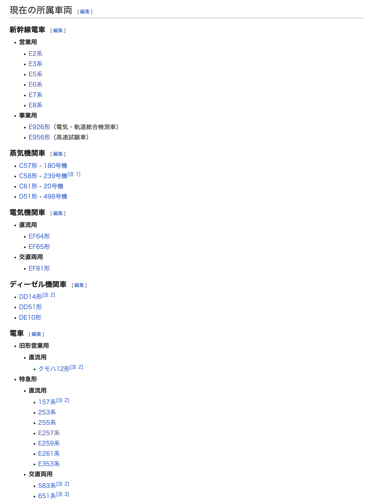
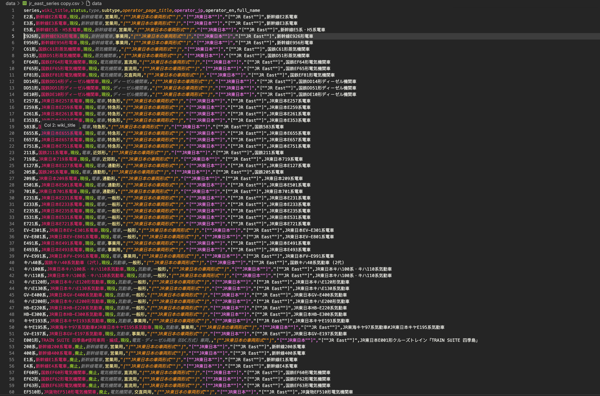
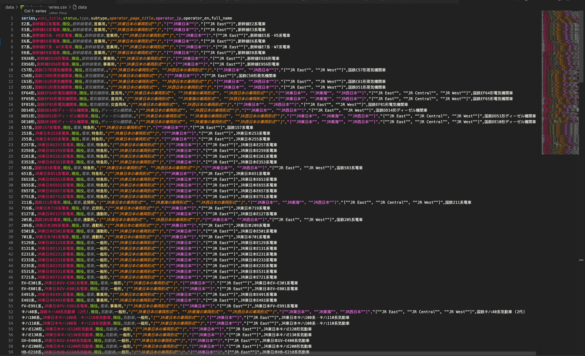

其实获得这个想法的经纬也很简单————打鸟佬们常用的“懂鸟”小程序。一半是想要自己做一点DL相关的东西而不是天天围绕训好的LLM做花式prompt engineering打转，二来还是想找点与自己相关的事情。其实曾经想过去模仿[乗りつぶし](https://www.noritsubushi.org/)这个乘车记录网站，做一个东南亚版的：至少他简单。不过本人确实无论如何对前端一无所知，靠着Claude Code才勉强写了一个Vue App用，不过因为归根结底还是一个较多放给Vibe Coding的项目，不可避免地背上了技术债+重构成本，确实有些放弃治疗了。也许等到有耐心的时候我会从头学吧。


总之回到正题，当发现没有数据集可用的时候大概心里一瞬想到大量苦心爆肝数据集的前辈和一些著名数据集。突然觉得不给arxiv丢上去一篇report写写这个数据集恐怕对不起我的工伤（事实证明才刚刚开始）（开玩笑的）。

对于模型选择上，暂定使用DINOv3+Head+SupCon Loss进行后训练调试。不过对于数据的筛选，打算使用对齐非常好的CLIP，针对复杂的图片（例如车辆正面，侧面，内饰，原理图，这些杂七杂八的图片都散布在Wiki Commons上，需要人工提取出来，即使用文件名匹配效果也不好）进行标记并分类。分类粒度暂定为系列，即不区分番台或仅区分差异较大或家族过于庞大的车型（例如E231系和他的无数孩子们）

---
## 数据集阶段

一次性提取所有数据实在太痛苦，暂时分为几个阶段

1. **Phase 1** — JR東日本
2. **Phase 2** — JR本州三社 (东、海、西）
4. **Phase 3** — JR全社（旅客6家+货物1家，但不包含客车货车）
5. **Phase 4** — 包含私铁车辆（大手私铁）

## 车辆型号提取

首先第一步肯定是抓到所有的车型，这样才有label和分类目标可用。最自然的数据来源当然是Wikipedia。日语版Wikipedia对JR各公司都有独立的「車両形式」页面，基本按照树状分类得比较好。车型基本都有内链到页面，省了解析型号的功夫。

不过注意给Media API发请求记得带上头，直接自己写一个就行，他们不会拒绝爬虫，也不用伪装UA。

对于API的返回结构。query.pages是一个以pageid为key的字典，而pageid是Wikipedia内部自动分配的数字，**在请求之前完全无从得知**。想拿到页面内容得直接解包一下字典：
`pythonpageid, page = next(iter(resp["query"]["pages"].items()))`靠把这个字典变成迭代器再迭代一次直接拿Value，把Key扔了。然后`page["revisions"][0]["slots"]["main"]["*"]`再这样一通拿到第一个revision正文就行。


总的来说解析Wikitext本身倒是顺利，规律相当清晰：H2标题区分「現在の所属車両」和「過去の所属車両」（不同JR其实写法不一样，因为Wikipedia也不是统一的数据库），H3标题是车种大类（新幹線電車、電気機関車等），车型条目藏在[[]]双括号里，显示名就是系列名。唯一需要注意的是用途标签行（'''営業用'''、'''事業用'''）——这些粗体行不含车型链接，解析时要跳过，但同时需要把它们记录下来作为`subtype`字段，不能直接丢掉。之后出了个问题是解析出来的`subtype`因为没有清空应用到了不该出现的地方，比如冒出来一个北陆新干线用的蒸汽机关车，，，

下面代码顺便让Claude Code代劳改成异步一次抓来。可以选择`operator`来选择爬取哪些公司。

```python
import asyncio

OPERATORS = [
    ("JR東日本", "JR East",    "JR東日本の車両形式"),
   #("JR東海",   "JR Central", "JR東海の車両形式"),
    #("JR西日本", "JR West",    "JR西日本の車両形式"),
]

HEADERS = {
    "User-Agent": "JapaneseTrainDatasetBuilder/1.0 (research project; fengyukunfyk@gmail.com)"
}

async def _fetch_one(
    client: httpx.AsyncClient, operator_jp: str, operator_en: str, page_title: str
) -> tuple[str, str, str, str]:
    params = {
        "action": "query",
        "titles": page_title,
        "prop": "revisions",
        "rvprop": "content",
        "rvslots": "main",
        "format": "json",
    }
    resp = await client.get("https://ja.wikipedia.org/w/api.php", params=params)
    resp.raise_for_status()
    pages = resp.json()["query"]["pages"]
    page = next(iter(pages.values()))
    print(f"页面：{page_title} 请求成功")
    return page_title, operator_jp, operator_en, page["revisions"][0]["slots"]["main"]["*"]

async def fetch_all(operators: list[tuple[str, str, str]]) -> dict[str, tuple[str, str, str]]:
    async with httpx.AsyncClient(headers=HEADERS, timeout=30) as client:
        results = await asyncio.gather(*[_fetch_one(client, jp, en, page) for jp, en, page in operators])
    # {page_title: (operator_jp, operator_en, wikitext)}
    return {page: (jp, en, wt) for page, jp, en, wt in results}

wikitexts = await fetch_all(OPERATORS)
wikitexts["JR東日本の車両形式"][2][:500]  # 预览
```

其实JR东的命名是最复杂的，除了国铁继承来的命名方法，例如纯数字（如485，205，211）、机车（E/D+轴数字母+功能，例如EF64，DD51），带形式（例如キハ、キヤ、モハ）的命名之外还有自己的命名，例如新的E开头的车辆（E231），混用的（キハE110），乱写的（GV-E400），放飞的（E001，四季岛用车），这在之后还导致去抓Wiki Commons的category名（纯英文）时需要复杂的转换，而且有很多case需要手动来。我真是脑子抽了来爬这个。后来带上本州三社发现JNR解体后继承的车大家有许多共同车型是个问题，还得把会社改成list。这还引入了不同会社的车型和不同番台之后怎么识别的问题，真是一坨大的。

在去掉客车和无动力货车平车，还有旧型的事业用车和旅客用车之后大概捞出来的数据如下，我筛选了一些代表性的放出来，按照csv格式：


种类十分丰富（绝望）

以及本州三社的部分数据



---

## Commons Category 检索

拿到了车型列表之后，下一步自然是去 Wikimedia Commons 按图索骥。Commons 上对大多数有一定知名度的列车型号都有专属的 category，还包含各种子分类，里面收录了各类摄影作品，
问题是 Commons 的 category 全是英文，只能自己写转换了。 Commons API 提供了 `acprefix` 参数，可以前缀搜索 category 名，只要能把日文型号名正确转换成英文前缀就行。

### 命名规则

Commons 的命名规律大致如下：

- 公司前缀：`JR East E231`、`JR Central HC85`、`JR West 225`
- 国铁继承车辆依然是JNR，统一用 `JNR`：`JNR EF64`、`JNR Kiha 40`
- 新干线系列用 `Shinkansen`：`Shinkansen E5`、`Shinkansen N700`

运营商前缀的判断不能单靠 `operator_jp` 字段，因为同一辆车（比如 EF64 形）可能被 JR东日本， JR货物继承，但 Commons 里还是叫 `JNR EF64`。需要检测 `wiki_title` 是否以「国鉄」开头来判断。

### 片假名转罗马字

麻烦的是含片假名的型号。`キハ40系` 在 Commons 里是 `JNR Kiha 40`，`キヤE195系` 是 `JR East Kiya E195`。需要实现一个片假名→罗马字转换器。

转换本身不难，就是查表——但有两个细节：

**双字节组合优先匹配**。シャ（sha）、チャ（cha）这类拗音必须在匹配单个シ（shi）之前先检查，否则シャ会被拆成 `shi` + `ya`，输出 `shiya` 而不是 `sha`。

**空格处理**。片假名前缀和后面的编号之间需要加空格：`Kiha 40`、`Kiya E195`。最初只对数字开头的情况加了空格（`Kiha 40` ✓），漏掉了字母开头的（`KiyaE195` ✗），结果有些型号搜不到。

### 片假名前缀的不稳定性

更头疼的是片假名前缀在 Commons 里是否保留并不稳定。`キヤE193系` 对应的是 `JR East E193`（前缀被丢弃），而 `キヤE195系` 对应的是 `JR East Kiya E195`（前缀保留）。两个几乎一样的型号，规律完全不同，没法静态判断。好吧还是因为大家都没有命名规则
解决办法是生成两个候选前缀，顺序尝试，取第一个返回非空结果的：

```python
def series_to_commons_prefixes(series, operator_jp, series_type, wiki_title):
    op   = _operator_prefix(operator_jp, series_type, wiki_title)
    name = re.sub(r'[系形]$', '', series)

    m = re.match(r'^([゠-ヿ]+)(.*)', name)
    if m:
        romaji = _katakana_to_romaji(m.group(1)).capitalize()
        rest   = m.group(2)
        with_kata    = f"{op} {romaji} {rest}".strip()  # e.g. "JR East Kiya E195"
        without_kata = f"{op} {rest}" if rest else None  # e.g. "JR East E195"
        return [with_kata, without_kata] if without_kata else [with_kata]
    else:
        return [f"{op} {name}"]
```

### Commons 合并分类的问题

还有一个更难处理的情况：Commons 有时会把关联型号合并到同一个 category 下。比如 481系、483系、485系、489系 在技术上属于同一家族，Commons 把它们全归在 `JNR 485` 下，直接搜 `JNR 481` 返回空。这类情况无法自动检测，只能先置空手动回来处理了。
至少每个车型为了写wiki页面一定有图，而且我相信日本人应该拍了很多。
### 目前进展

现在已经对本州三社全部车型跑了一遍搜索，结果写回了 DataFrame：

```python
all_model["commons_prefix"] = commons_prefixes  # 命中的搜索前缀
all_model["commons_cats"]   = commons_cats       # 返回的 category 列表
```

空结果的条目还留在表里，等人工过一遍——区分「确实没有 Commons category」和「前缀转换有误」两种情况，要么合并进去自己改然后再匹配。
下一步是对每个 category 递归拉取子 category 和图片 URL，然后进入异步批量下载。
