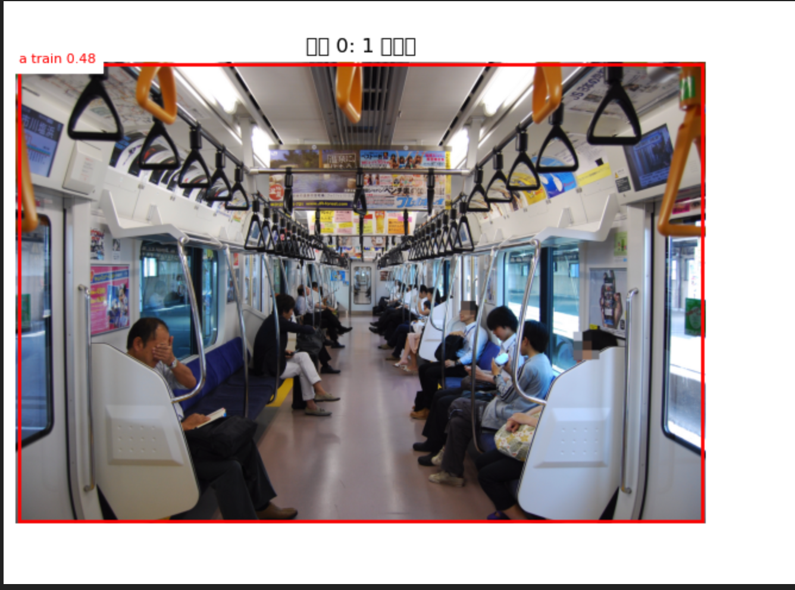
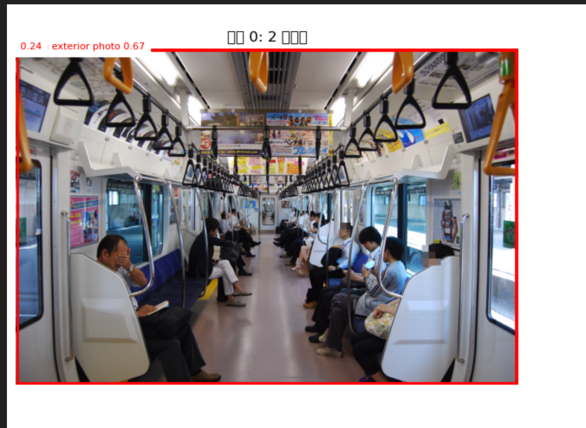

## 内饰，局部细节特写图片的清洗

内饰图片，虽然具有火车特征但是和外部照片差距过大，试图用一个模型去handle泛化似乎不太可能。加之许多车辆内饰都采用高度相似的风格设计，例如JR东日本的E217-E231-E233-E235系列（尽管有微小差别），甚至蔓延到了新潟地区用车E129。虽然不在目前的scope，但是阪急电铁的车内内饰也高度统一，如此试图区分车辆种类不太划算。加之，**DINO的车辆判断下会把车辆内饰作为特征判定为一整个火车**，所以必须滤除这个部分。

 

之后试图用Grounding DINO寻找boundary box进行Zero-shot的多列车识别，发现Grounding DINO在未微调的情况下语义上无法细微区分机车，动车组，车辆内部与外部，在训练中可能train标签也泛化到了内饰，导致如果内饰图片进入就完全无法检测数量。**所以有必要严格去掉所有的内饰图**


不过实践最后采用了一个非常取巧的设计。在前一个笔记本中我已经根据能想到的关键词大概写了一个粗略过滤，
```python
FILE_EXCLUDE_PATTERNS = (
    "interior", "inside", "seat", "seats", "seating", "reclining", "free-space",
    "cab", "cockpit", "toilet", "wc", "route map", "counter", "merchandising counter",
    "display", "lcd", "vvvf", "logo", "air cleaner", "antenna", "pantograph",
    "camera", "accident", "syanai", "車内", "運転台", "運転室", "トイレ", "便所","カメラ", "事故", "車内",
    "trainchannel",
    "運転台", "運転室", "トイレ", "便所",
    "洗面所", "洗面台", "モニター", "カウンター", "停車駅案内", "案内表示器",
    "パンタグラフ", "エアクリーナー", "集電装置", "エアコン", "クーラー",
)

CATEGORY_EXCLUDE_PATTERNS = (
    "interior", "inside", "parts", "seats", "information display", "mockup","green car"
)
```


上述的关键词，在文件名和category两个尺度下做了过滤，已经显著减少透过来的图片了，不过还有许多细节，例如可能座椅吊环等细节，还有台车等位置无法纳入。所以在后面又加上了LLM过滤。
```python
from openai import OpenAI
client = OpenAI()
# PROMPTS
SYSTEM_PROMPT_excluding = """
你是一个日本铁路图片分类助手，通过Wikipedia Commons图片的分类路径来判断图片所属铁路车辆的类别信息。请在必要时通过web_search查找相关信息辅助判断，不要随意猜测。
你将会收到每张图片的文件名以及其category_path（一个字符串列表，表示图片在Wikipedia Commons上的分类路径）。请根据这些信息判断图片是车辆整体照片还是内部照片或细节照片，例如显示屏，驾驶位，厕所等。
请在文件名或category_path中寻找明确信号，若无法判断则默认不排除。
请为每个图片输出一个JSON对象，给你的一个batch请将他们的结果输出为一个JSON数组。请保持图片的ID不变输出。每个JSON对象的格式如下：
{"id":<图片ID>, "exclude": <是否排除，0表示不排除，1表示排除>, "reason": <如果排除请给出理由，在interior, detail之间选择一个。>}
"""
```

下面是发送请求，其他的断点续传逻辑省略，考虑到任务非常简单，使用了`gpt-5.4-mini`，**并试图令其使用网络搜索，虽然这个代码在替换过程中被改掉了，但是在没有网络搜索的情况下，依然超出预期，能够通过台车型号过滤掉局部照片**
```python
def request_exclude_batch(batch_str: str) -> list[dict]:
    """Call the LLM for one batch and retry when the output is not valid JSON."""
    last_error = None
    for attempt in range(1, MAX_LLM_RETRIES + 1):
        response = client.responses.create(
            model=OPENAI_MODEL_NAME,
            input=[
                {"role": "system", "content": SYSTEM_PROMPT_excluding},
                {"role": "user", "content": batch_str},
            ],
            reasoning={"effort": "low"},
        )
        try:
            return parse_llm_json_array(response.output_text)
        except (json.JSONDecodeError, ValueError) as exc:
            last_error = exc
            print(f"JSON parse failed ({attempt}/{MAX_LLM_RETRIES}): {exc}")
            print((response.output_text or "")[:500])
            time.sleep(1)
    raise RuntimeError(f"LLM JSON parse failed after retries: {last_error}")

```

其实正常应该在API调用出加上`tools=[{"type": "web_search"}],`的，不过发现没有居然也有较好的表现。因为没有Ground Truth没法测试召回率，我们会试图在后面继续解决这个问题。不过通过随机抽样依旧能发现有绿车内部图片进入，可能是在文件名上也完全没有提示信息。
这里要使用对比学习语义对齐更强的模型，例如`CLIP`。由于是非常粗的二分法，所以只需要其语义理解能力即可，不需要细粒度。除此之外可以使用其更强的版本，`SigLIP-2`。我们会在之后回到这个问题上。


## LLM格式化处理 车型，番台，特殊编成，涂装，运营公司

```python
from openai import OpenAI
client = OpenAI()
# TODO 处理番台和子车型依然有问题，有混用。下一步明确prompt
# PROMPTS
SYSTEM_PROMPT_DETAILS = """
你是一个日本铁路图片分类助手，通过Wikipedia Commons图片的分类路径来判断图片所属铁路车辆的各种信息，包括子车型，番台，特殊编成，特殊涂装，运行线路，运营公司等。请在必要时通过web_search查找相关信息辅助判断，不要随意猜测。
你将会收到category_path（一个字符串列表，表示图片在Wikipedia Commons上的分类路径）。请根据这些信息判断以下的内容，若不满足条件或没有该项相关内容请直接留空。不需要做任何补充说明，直接输出JSON，不输出任何解释与备注。
- 子车型：一些较大型号车型家族下的细分型号，注意不是番台。例如，kiha 40系列下有kiha 40, kiha 47, kiha 147等车型。这一项输出请不要带任何series等后缀，也不要加上运营商前缀例如JRF。直接输出子车型的名称，例如kiha 147，E231-1000等。罗马音写的表记请保持只有首字母大写，例如文件中可能的KiHa也写成Kiha。如果没有明确的子车型信息请留空，不要随意猜测，也不要直接写机车型号。
- 番台：某类车型的细分型号，一般会标出番台，例如JR东日本的E231-1000系列中有E231-1000番台和E231-3000番台。但请不要输出机车的车号，例如C57 180号机或者 DD51 1043号。有些图片也会以车号给出，例如E231-517号车，此时则为500番台。但请注意番台并不一定是百位千位，若不确定请查询相关信息，例如该车型的番台列表，然后判断。这里**只写番台本身**，例如0，100，8000，不写前缀也不带番台后缀。
- 运营公司：例如JR东日本，JR西日本，JR东海，JR北海道，JR九州，JR四国等。可以从category路径的备注中和文件名看出，请输出其英文名及日文名，例如JR East/JR東日本, JR West/JR西日本, JR Central/JR東海, JR Hokkaido/JR北海道, JR Kyushu/JR九州, JR Shikoku/JR四国等。
- 特殊编成：以特殊名称命名的一些编成，例如etSETOra，Resort Shirakami Aoike。由于文件是由英语写就，请直接输出罗马字或英文标记的名字。
- 特殊涂装：一些车型拥有的特殊涂装，常见以"livery"在路径或文件名中出现，例如"Hokutosei livery"，也请输入日文原名，例如北斗星，不要带涂装等字样。

以上内容请输出为JSON数组，每个元素格式如下：
{"submodel": <车型>, "bandai": <番台>, "operator_en": <运营公司英文名>, "operator_jp": <运营公司日文名>, "special_formation": <特殊编成>, "special_livery": <特殊涂装>}
"""
```

没有什么内容，基本就是参考上面的prompt。不过对于语义上的格式化输出还需要更多的数据验证prompt是否足够sound。唯一的注意点就是，由于图片实在太多我们只在category path上找，而对于这个问题，在category树上位于同一个叶节点的图片肯定有同样的path，所以大幅压缩了需要处理的数据。
```csv
series,wiki_title,status,type,subtype,operator_page_title,operator_jp,operator_en,full_name,commons_prefix,commons_root_category,commons_root_decision,commons_candidates,needs_review,commons_operator_roots
E2系,新幹線E2系電車,現役,新幹線電車,営業用,['JR東日本の車両形式'],['JR東日本'],['JR East'],新幹線E2系電車,Shinkansen E2,Shinkansen E2,exact prefix match,"['Shinkansen E2', 'Shinkansen E2 (200 series livery)', 'Shinkansen E2 (pink line livery)', 'Shinkansen E2 (red line livery)', 'Shinkansen E2 at Fukushima Station (Fukushima)', 'Shinkansen E2 at Hachinohe Station', 'Shinkansen E2 at Kumagaya Station', 'Shinkansen E2 at Kōriyama Station (Fukushima)', 'Shinkansen E2 at Morioka Station', 'Shinkansen E2 at Nagano Station', 'Shinkansen E2 at Niigata Station', 'Shinkansen E2 at Sendai Station (Miyagi)', 'Shinkansen E2 at Shin-Aomori Station', 'Shinkansen E2 at Tokyo Station', 'Shinkansen E2 at Ueno Station', 'Shinkansen E2 at Utsunomiya Station', 'Shinkansen E2 at Ōmiya Station (Saitama)', 'Shinkansen E2 on Hokuriku Shinkansen', 'Shinkansen E2 on Jōetsu Shinkansen', 'Shinkansen E2 on Tōhoku Shinkansen']",False,{'JR East': 'Shinkansen E2'}
E3系,新幹線E3系電車,現役,新幹線電車,営業用,['JR東日本の車両形式'],['JR東日本'],['JR East'],新幹線E3系電車,Shinkansen E3,Shinkansen E3,exact prefix match,"['Shinkansen E3', 'Shinkansen E3-0', 'Shinkansen E3-1000', 'Shinkansen E3-1000 in silver livery', 'Shinkansen E3-1000 in white and purple livery', 'Shinkansen E3-2000', 'Shinkansen E3-2000 in silver livery', 'Shinkansen E3-2000 in white and purple livery', 'Shinkansen E3-700', 'Shinkansen E3 at Akita Station', 'Shinkansen E3 at Fukushima Station (Fukushima)', 'Shinkansen E3 at Kōriyama Station (Fukushima)', 'Shinkansen E3 at Morioka Station', 'Shinkansen E3 at Sendai Station (Miyagi)', 'Shinkansen E3 at Shinjō Station', 'Shinkansen E3 at Tokyo Station', 'Shinkansen E3 at Ueno Station', 'Shinkansen E3 at Utsunomiya Station', 'Shinkansen E3 at Yamagata Station', 'Shinkansen E3 at Ōmagari Station (Akita)']",False,{'JR East': 'Shinkansen E3'}
E5系,新幹線E5系・H5系電車,現役,新幹線電車,営業用,['JR東日本の車両形式'],['JR東日本'],['JR East'],新幹線E5系・H5系電車,Shinkansen E5,Shinkansen E5,exact prefix match,"['Shinkansen E5', 'Shinkansen E5 at Hachinohe Station', 'Shinkansen E5 at Kōriyama Station (Fukushima)', 'Shinkansen E5 at Morioka Station', 'Shinkansen E5 at Sendai Station (Miyagi)', 'Shinkansen E5 at Shin-Aomori Station', 'Shinkansen E5 at Shin-Hakodate-Hokuto Station', 'Shinkansen E5 at Tokyo Station', 'Shinkansen E5 at Ōmiya Station (Saitama)', 'Shinkansen E5 on Hokkaidō Shinkansen', 'Shinkansen E5 on Tōhoku Shinkansen', 'Shinkansen E5 series E514 mockup']",False,{'JR East': 'Shinkansen E5'}
E6系,新幹線E6系電車,現役,新幹線電車,営業用,['JR東日本の車両形式'],['JR東日本'],['JR East'],新幹線E6系電車,Shinkansen E6,Shinkansen E6,exact prefix match,"['Shinkansen E6', 'Shinkansen E6 at Akita Station', 'Shinkansen E6 at Morioka Station', 'Shinkansen E6 at Sendai Station (Miyagi)', 'Shinkansen E6 at Tokyo Station', 'Shinkansen E6 at Ōkama Station', 'Shinkansen E6 at Ōmagari Station (Akita)', 'Shinkansen E6 at Ōmiya Station (Saitama)', 'Shinkansen E6 on Akita Shinkansen', 'Shinkansen E6 on Tōhoku Shinkansen']",False,{'JR East': 'Shinkansen E6'}
E7系,新幹線E7系・W7系電車,現役,新幹線電車,営業用,['JR東日本の車両形式'],['JR東日本'],['JR East'],新幹線E7系・W7系電車,Shinkansen E7,Shinkansen E7,exact prefix match,"['Shinkansen E7', 'Shinkansen E7 (pink line livery)', 'Shinkansen E7 at Kanazawa Station', 'Shinkansen E7 at Nagano Station', 'Shinkansen E7 at Tokyo Station', 'Shinkansen E7 at Ueno Station', 'Shinkansen E7 at Ōmiya Station (Saitama)', 'Shinkansen E7 on Hokuriku Shinkansen', 'Shinkansen E7 on Jōetsu Shinkansen', 'Shinkansen E7 on Tōhoku Shinkansen']",False,{'JR East': 'Shinkansen E7'}
E8系,新幹線E8系電車,現役,新幹線電車,営業用,['JR東日本の車両形式'],['JR東日本'],['JR East'],新幹線E8系電車,Shinkansen E8,Shinkansen E8,exact prefix match,"['Shinkansen E8', 'Shinkansen E8 at Ōmiya Station (Saitama)', 'Shinkansen E8 on Tōhoku Shinkansen']",False,{'JR East': 'Shinkansen E8'}
E926形,新幹線E926形電車,現役,新幹線電車,事業用,['JR東日本の車両形式'],['JR東日本'],['JR East'],新幹線E926形電車,Shinkansen E926,Shinkansen E926,exact prefix match,['Shinkansen E926'],False,{'JR East': 'Shinkansen E926'}
E956形,新幹線E956形電車,現役,新幹線電車,事業用,['JR東日本の車両形式'],['JR東日本'],['JR East'],新幹線E956形電車,Shinkansen E956,Shinkansen E956,exact prefix match,['Shinkansen E956'],False,{'JR East': 'Shinkansen E956'}
C57形,国鉄C57形蒸気機関車,現役,蒸気機関車,,['JR東日本の車両形式'],['JR東日本'],['JR East'],国鉄C57形蒸気機関車,C57 steam locomotive,C57 steam locomotives,plural category match,"['C57 steam locomotives', 'C57 steam locomotives (Hokkaido)', 'C57 steam locomotives by number', 'C57 steam locomotives in service']",False,{'JR East': 'C57 steam locomotives'}
C58形,国鉄C58形蒸気機関車,現役,蒸気機関車,,['JR東日本の車両形式'],['JR東日本'],['JR East'],国鉄C58形蒸気機関車,C58 steam locomotive,C58 steam locomotives,plural category match,"['C58 steam locomotives', 'C58 steam locomotives (Hokkaido)', 'C58 steam locomotives by number', 'C58 steam locomotives in service']",False,{'JR East': 'C58 steam locomotives'}
C61形,国鉄C61形蒸気機関車,現役,蒸気機関車,,['JR東日本の車両形式'],['JR東日本'],['JR East'],国鉄C61形蒸気機関車,C61 steam locomotive,C61 steam locomotives,plural category match,"['C61 steam locomotives', 'C61 steam locomotives in service']",False,{'JR East': 'C61 steam locomotives'}
```

数据基本类似这样，可以观察到同一个细分车型path都是一样的，用LLM处理唯一的path之后，再回写就好了。细节上为了保证未来可以多次扩充数据集，我们依旧让代码幂等。
```python
# 将 category details 回写到 images 表。幂等。
DETAIL_COLS = ["submodel", "bandai", "operator_en", "operator_jp", "special_formation", "special_livery"]
DETAILS_CSV = os.path.join(PROJECT_ROOT, "data", "llm_category_details.csv")

if "llm_details" in locals():
    details_df = llm_details.copy()
else:
    details_df = pd.read_csv(DETAILS_CSV)

def sql_null(v):
    """Coerce empty/sentinel strings to None so SQLite stores NULL."""
    if pd.isna(v):
        return None
    v = str(v).strip()
    return None if v.lower() in {"", "nan", "none", "null"} else v

# Only normalize the text detail columns — category_path holds lists and must not be touched.
details_df[DETAIL_COLS] = details_df[DETAIL_COLS].map(sql_null)

missing = [c for c in ["category_path_json", *DETAIL_COLS] if c not in details_df.columns]
if missing:
    raise ValueError(f"details missing columns: {missing}")

with sqlite3.connect(db_path) as conn:
    existing = {row[1] for row in conn.execute("PRAGMA table_info(images)")}
    for col in DETAIL_COLS:
        if col not in existing:
            conn.execute(f"ALTER TABLE images ADD COLUMN {col} TEXT")

    set_clause = ", ".join(f"{col} = ?" for col in DETAIL_COLS)
    update_rows = details_df[DETAIL_COLS + ["category_path_json"]].values.tolist()
    conn.executemany(f"UPDATE images SET {set_clause} WHERE category_path_json = ?", update_rows)
    conn.commit()

    print(f"detail category paths written: {len(update_rows)}")
    display(pd.read_sql_query(
        """
        SELECT
            COUNT(*) AS total_images,
            SUM(submodel IS NOT NULL) AS with_submodel,
            SUM(bandai IS NOT NULL) AS with_bandai,
            SUM(operator_en IS NOT NULL) AS with_operator,
            SUM(special_formation IS NOT NULL) AS with_special_formation,
            SUM(special_livery IS NOT NULL) AS with_special_livery
        FROM images
        """,
        conn,
    ))
    display(pd.read_sql_query(
        """
        SELECT category_path_json, submodel, bandai, operator_en,
               operator_jp, special_formation, special_livery, COUNT(*) AS image_count
        FROM images
        WHERE submodel IS NOT NULL OR bandai IS NOT NULL OR operator_en IS NOT NULL
           OR special_formation IS NOT NULL OR special_livery IS NOT NULL
        GROUP BY category_path_json, submodel, bandai, operator_en,
                 operator_jp, special_formation, special_livery
        ORDER BY image_count DESC
        LIMIT 20
        """,
        conn,
    ))
```
有几个Trick，虽然不是我写的。set_clause进行了动态展开，最后的语句比较类似
```SQL
UPDATE images
SET
    submodel = ?,
    bandai = ?,
    operator_en = ?,
    operator_jp = ?,
    special_formation = ?,
    special_livery = ?
WHERE category_path_json = ?;
```
同时也防注入，同时也只需要修改最上面的list就能修改需要插入的字段了。然后用了`conn.executemany(sql, update_rows)`不需要循环就可以apply到所有条目。


## Grounding DINO进行车辆对象数量判断及Boundary Box生成

`Grounding DINO`作为基于Transformer的detector模型，可以提供由Transformer架构带来的文本引导能力，所以可以直接给出一个个体描述，例如'a train'就可以让他进行侦测，并输出boundary box和confidence。但是比起VLM来说，他没有ViT再concat文字prompt的过程，也就没有幻觉或者遮挡问题。当然也如最开始提到，语义引导做不到zeroshot细粒度，所以去掉内饰图片就很重要了。
```python
model_id = "IDEA-Research/grounding-dino-base"
device = Accelerator().device
processor = AutoProcessor.from_pretrained(model_id)
model = AutoModelForZeroShotObjectDetection.from_pretrained(model_id).to(device)

#随机抽样几张图来看看判断多物体能力
SAMPLE_SIZE = 6
with sqlite3.connect(db_path) as conn:
    sample_images = pd.read_sql_query(f""" SELECT id, downloaded_path FROM images WHERE excluded = 0 AND download_status = 'downloaded' ORDER BY RANDOM() LIMIT {SAMPLE_SIZE}""", conn)

paths = [os.path.join(PROJECT_ROOT, "data", p) for p in sample_images["downloaded_path"]]

images = [Image.open(path) for path in paths]
label = ["a train exterior photo"]
text_labels = [label] * len(images)  # 每张图都用同样的标签，测试模型的多物体识别能力

inputs = processor(
    images=images,
    text=text_labels,
    return_tensors="pt",
    padding=True,       # 重要：batch内图片尺寸不同时需要padding
).to(device)

with torch.no_grad():
    outputs = model(**inputs)
```
直接从HF上把模型抓下来然后Image直接送进去就可以了。然后需要一些后处理，例如模型内部的坐标是`Height, Width`，以及bbox的坐标是Standardization之后的\[0,1]坐标。之后拿到bbox丢给matplotlib画图就行了，我不关心所以丢给Codex生成画图代码了。

```python
target_sizes = [img.size[::-1] for img in images] # (width, height) -> (height, width)，每张图片单独从归一化坐标转换回原始尺寸

results = processor.post_process_grounded_object_detection(
    outputs,
    inputs.input_ids,
    threshold=0.2,
    text_threshold=0.3,
    target_sizes=target_sizes,
)

# results是list，每个元素对应一张图
for i, result in enumerate(results):
    print(f"\n图片 {i}:")
    for box, score, label in zip(result["boxes"], result["scores"], result["labels"]):
        box = [round(x, 2) for x in box.tolist()]
        print(f"  {label}: {round(score.item(), 3)} @ {box}")
```


结果来看识别主体还是非常准的，不过被遮挡就比较微妙：


然后专门弄点多车辆的图来看看,特别对于连结的表现比较微妙，后面可能以此为基础判断之后，采用从样本中few-shot交叉检测的方式，看看能不能抓出真正的主体（就是用同类别下的其他数据抓到bbox之后用它作为few-shot去找连结图里的主体，或判断是否保留过滤）

和Claude探讨一下，对于下面这种连结BBox重复的问题可以用NMS去重来解决。明天来做。
